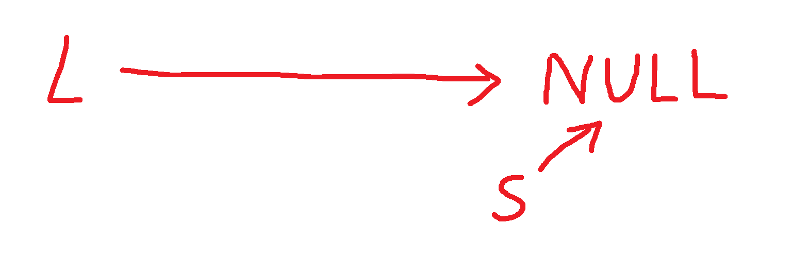
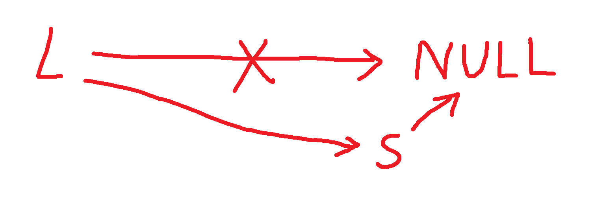
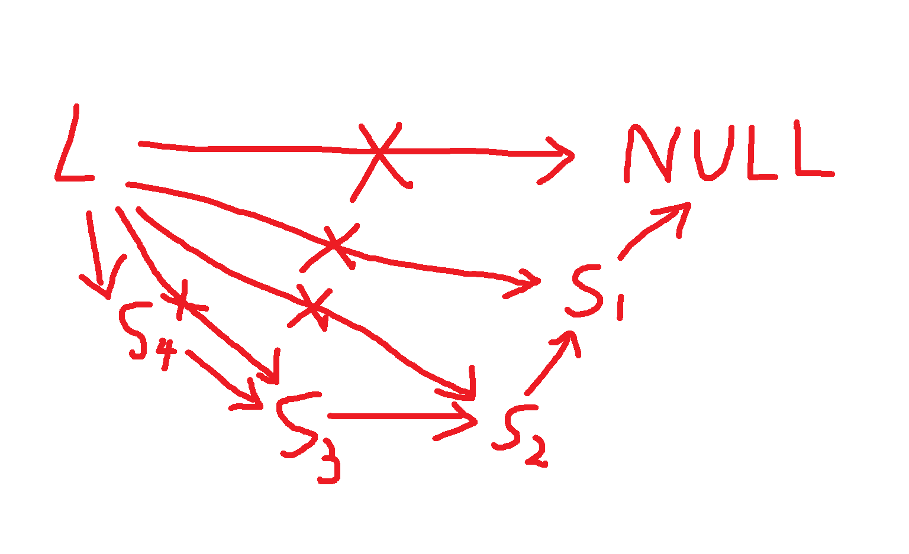

## 动态数据结构：链表
到目前为止，我们接触到的数据结构还只有2种：**数组和结构体**；  
如果只需要储存同一种数据类型，那么数组无疑是最合适的选择；

但是，数组也有它的缺陷：**大小固定**，增减元素困难；  
同时，即使你数组还有空位，要在数组里面**插入**一个元素，也不得不移动数组里面的大量元素，**效率极低**；

因此，我们需要一种新的数据结构，它应该具有以下优点：  
1. 大小不固定，甚至不需要在定义时确定大小；
2. 插入元素方便，无需挪动整个结构；

这个新的数据结构就是**链表**；

链表是一种大小可变，通过**节点**存储数据，通过**指针**实现连接的数据结构；可以看成一根线串着若干个节点；  
当它插入和删除元素时，只需要修改**相邻2个元素**的连接关系就可以了，无需移动任何其它东西；

节点以**结构体**的形式呈现，结构体里面存放着一个节点数据和指向下一个（也可能是上一个）的1个或2个指针；一般形式如下：
```c
typedef struct tagNODE
{
    int data;
    struct tagNODE *link;
} node;
```
这时通过对指针link取值可以访问到它连接的另一个节点数据；

由于链表可以存放1~2个指针，因此也有**单链表**和**双链表**之分；

通常链表里面还包含一个头节点`L`，它作为链表访问的**入口**，不储存数据，只有1~2个指针值；

### 单链表
单链表差不多就是上面这种形式：
```c
typedef struct tagNODE
{
    int data;
    struct tagNODE *next;
} node,*linklist;
```
其中node是节点的结构体数据类型，通过node可以知道任意节点占用的内存；  
而*linklist是指向链表某一节点的指针；  
至于为什么要设计成指针，这与后面链表的创建有关；  

取下一个节点数据只需要`next->data`即可；

### 双链表
双链表相比于单链表，多了指向上一个元素的指针：这样头尾可以互换；
```c
typedef struct tagNODE
{
    int data;
    struct tagNODE *prev,*next;
} node,*linklist;
```
它不仅可以取下一个节点数据，还可以往回取，因此这种链表虽然更加复杂，但是更加容易维护，一条链断了或者数据缺失了都可以使用另外的方法恢复链表；

### 循环链表
循环链表就是最后一个节点的指针指向第一个节点；循环链表让链表数据的访问变得更加快捷；
>比如，从倒数第2个节点访问第2个节点只需要跨过2个节点，而不是将近整个链表；

单双链表和是否循环使得链表有4种形式；但是考虑到占用空间和访问速度，常用的链表只有2种：**不循环单链表和循环双链表**；

## 链表的创建
在C语言中，一般使用**动态内存分配**的方法为链表里的数据分配内存空间，然后再使用**头插法**或者**尾插法**实现数据的填写；  
因此，头文件`stdlib.h`在链表的创建里面是必要的；  

### 头节点的创建
每个链表都需要一个头节点作为入口，同时和其它链表进行区分；  
当程序中只出现一个链表时，一般将其设置成`L`;

创建一个链表时，必须先创建一个头节点，并为其分配空间；
代码如下：
```c
#include <stdlib.h>
// 定义链表结构体
typedef struct tagNODE
{
    int data;
    struct tagNODE *prev,*next;
} node,*linklist;

linklist L=NULL;
L=(linklist)malloc(sizeof(node));
```

### 分配空间
只能一个节点一个节点的分配；且和头节点的内存分配类似；

由于malloc的内存分配的地址具有随机性，因此链表的数据是**不连续存放**的，这点与数组不同；  
但是不妨碍，通过指针prev和next可以轻松访问到相邻的节点，而且这样还可以充分利用内存空间；

### 创建单链表
在创建链表的时候，需要知道头节点`L`的地址和节点的个数`n`;  
常常用到头节点指针`p`进行辅助，它的作用是记录当前节点的地址，以让下一个节点与当前节点相邻；
#### 头插法
头插法最先插入的是最后一个节点，它的`next`设定为`NULL`；  
头插法的步骤如下：  
1. 创建节点指针`p`，为其数据分配空间，并设置`p->next`为`NULL`；这时`p->next`可以充当**链表末尾**；
2. 创建节点`s`，并为其动态分配内存；然后输入s的数据；
3. 将`s`插入到链表末尾的位置，然后把`p->next`移动到`s`；
4. 重复2~3步骤以插入更多节点；

以下是图示:

初始状态(`p`和`L`在同一个位置)：

将`s`插入到链表末尾：

将`p->next`移动到`s`：

重复操作：


具体代码如下：
```c
void CreateLinkF(linklist L,int n)
{
    linklist p,s;
    int i;
    // 创建节点指针p
    p=L;
    p->next=NULL;

    // n次循环
    for(i=0;i<n;i++)
    {
        // 创建节点s并输入数据
        s=(linklist)malloc(sizeof(node));
        scanf("%d",&(s->data));

        // 将s插入到p的位置，然后把p向上移动一个节点；
        s->next=p->next;
        p->next=s;
    }
}
```

#### 尾插法
尾插法最先插入的是第一个节点，再逐步添加节点，最后将末尾节点的next设置成NULL；  
尾插法的步骤如下：
1. 创建头节点`p`，为其数据分配空间；
2. 创建节点`s`，并为其动态分配内存；然后输入s的数据；
3. 将`s`插入到`p`的下一个节点，然后将`p`移动到`s`的位置；
4. 重复2~3步骤以插入更多节点；
5. 插入完毕后，将最后一个节点的`next`设置为NULL；

以下是图示：
初始状态：

将`s`移动到`p->next`：

将`p`移动到s：
   
重复操作：

将最后一个节点的next设置成NULL：
![alt text][def]

具体代码如下：
```c
void CreateLinkR(linklist L,int n)
{
    linklist p,s;
    int i;
    // 创建节点指针
    p=L;
    p->next=NULL;

    // n次循环
    for(i=0;i<n;i++)
    {
        // 创建节点s并输入数据
        s=(linklist)malloc(sizeof(node));
        scanf("%d",&(s->data));

        //将s插入到p的下一个节点，然后将p移动到s的位置；
        p->next=s;
        p=s;
    }
    // 将最后一个节点的next设置为NULL；
    p->next=NULL;
}
```

#### 循环链表
循环链表即最后一个节点指向的是第一个节点（**不是头节点`L`！**），而不是NULL；  
故需要tmp指针记录第一个节点的地址，并让最后一个节点的next指向它；

#### 空链表
空链表指的是没有节点的链表；  
省略掉**循环步骤**就可以创建一个空链表；

### 创建双链表
双链表和单链表不同的地方在于双链表有2个结构体指针，分别指向前面和后面的节点，换句话说，双链表每两个相邻节点之间都有2条链；  
因此，只需要在加入一个节点时，把另外一条链(prev)连上就可以了；

#### 头插法
```c
void CreateLinkF(linklist L,int n)
{
    linklist p,s;
    int i;
    // 创建节点指针p
    p=L;
    p->prev=p->next=NULL;

    // n次循环
    for(i=0;i<n;i++)
    {
        // 创建节点s并输入数据
        s=(linklist)malloc(sizeof(node));
        scanf("%d",&(s->data));

        // 将s插入到p的位置
        s->next=p->next;

        // 设置s的前后指针，以让两条链都链接
        if(p->next!=NULL)p->next->prev=s;
        p->next=s;
    }
}
```

#### 尾插法
```c
void CreateLinkR(linklist L,int n)
{
    linklist p,s;
    int i;
    // 创建节点指针
    p=L;
    p->prev=p->next=NULL;

    // n次循环
    for(i=0;i<n;i++)
    {
        // 创建节点s并输入数据
        s=(linklist)malloc(sizeof(node));
        scanf("%d",&(s->data));

        //链接s和p的2条链，然后将p移动到s的位置；
        p->next=s;
        s->prev=p;
        p=s;
    }
    // 将最后一个节点的next设置为NULL；
    p->next=NULL;
}
```

#### 循环链表
需要tmp指针记录第一个节点的地址，并让最后一个节点的next指向它；

#### 空链表
省略掉**循环步骤**就可以创建一个空链表；

## 链表的遍历
**注：此后的内容均以不循环单链表为例，循环及双链表同理可得。**  

创建链表后可以像数组一样遍历它；    
它的大致步骤如下：
1. 令节点指针`p`指向链表的头节点；
2. 访问完一个节点后，让`p`指向`p->next`以访问下一个节点；
3. 重复步骤2，直到`p=0`;

以下是代码：
```c
void ListTrarse(linklist L)
{
    linklist p=L->next;
    while(p!=NULL)
    {
        printf("%d\n",p->data);
        p=p->next;
    }
}
```
其中printf可以更改为其它函数，以实现**定制功能**；  
比如输出节点个数（不包含头节点）、输出特定节点数据、检测链表是否循环等等；

## 链表的销毁
链表也是动态内存分配来的，它的内存也需要释放；  
不过，由于链表的内存是不连续存放的，它的销毁较为复杂；  
链表的销毁一般通过链表的遍历和free函数实现；

链表的销毁根据对头节点的去留分为彻底销毁和重置为空表两类；  
由于2种方法仅有头节点处理的问题，因此这里只说彻底销毁的方法；

步骤如下：
1. 定义节点指针`p=L,q=L->next`;
2. 释放`p`的内存，然后`p`和`q`下移1个节点；
3. 重复步骤2直到`p==NULL`;
4. 将L扔到NULL里面去，以免产生**野指针**；(如果还需要使用的话，就令`L->next=NULL`)

代码如下：
```c
void DestroyLink(linklist L)
{
    linklist p,q;
    p=L;
    while(p!=NULL)
    {
        // 释放`p`的内存，然后`p`和`q`下移1个节点；
        q=p->next;
        free(p);
        p=q;
    }
    L=NULL;
}
```

## 链表节点的插入和删除
OK啊，我们对着链表说了这么多，费了那么多力气创建、遍历、销毁链表，为的是什么呢？当然就是为了现在更加快捷的**插入和删除元素**！  

**换句话说：就是为了这碟醋包的饺子！**

### 节点的插入
现在有一个孤立的节点`s`,现在要把插入到链表的第`i`个位置上，该如何做？简单分三步。  
首先，应该找到当前的第`i-1`个节点；  
然后，将`s`的`next`转到原来第`i`个，现在第`i+1`个节点上；   
最后，将`i-1`节点的`next`从转到`s`上；  
（这两步**不能颠倒**，否则找不到第i+1个节点）   

代码如下：
```c
int ListInsert(linklist s,linklist L,int i)
{
    linklist p=L;
    int t=0;
    while(p!=NULL&&t<i-1)
    {
        p=p->next;
        t++;
    }

    // 如果i的值过小或过大都会报错
    if(p==NULL||i<0)return 0;

    s->next=p->next;
    p->next=s;
    return 1;
}
```

### 节点的删除
我们现在要删除链表的第i个节点；  
并且，为了防止误操作，需要输出被删除的节点的数据；  
步骤如下：
1. 找到第`i-1`个节点；
2. 将第`i-1`个节点的`next`指向第`i+1`个节点；
3. 将第`i`个节点的`next`指向`NULL`；
4. 输出删除的节点数据，并释放内存；

代码如下：
```c
int ListDelete(linklist L,int i)
{
    linklist p,q;
    int t=0;
    p=L;
    while(p!=NULL&&t<i-1)
    {
        p=p->next;
        t++;
    }

    if(p==NULL||i<0)return 0;

    p->next=q->next;
    q->next=NULL;
    printf("%d",q->data);
    free(q);
    return 1;
}
```

## 实例
以下是一些链表操作的实例；

### 头插法（CreateLinkF.c）
输入：  
第一行输入插入元素的个数n，然后第二行输入n个数；

输出：  
储存的链表数据，和输入的数据是倒序的；

程序运行结束后销毁链表；
```c
#include <stdio.h>
#include <stdlib.h>
typedef struct tagNODE
{
    int data;
    struct tagNODE *next;
} node,*linklist;

void CreateLinkF(linklist L,int n)
{
    linklist p,s;
    int i;
    p=L;
    p->next=NULL;

    for(i=0;i<n;i++)
    {
        s=(linklist)malloc(sizeof(node));
        scanf("%d",&(s->data));

        s->next=p->next;
        p->next=s;
    }
}

void ListTrarse(linklist L)
{
    linklist p=L->next;
    while(p!=NULL)
    {
        printf("%d ",p->data);
        p=p->next;
    }
    printf("\n");
}

void DestroyLink(linklist L)
{
    linklist p,q;
    p=L;
    while(p!=NULL)
    {
        q=p->next;
        free(p);
        p=q;
    }
    L=NULL;
}

int main()
{
    linklist L=NULL;
    int n;
    scanf("%d",&n);
    L=(linklist)malloc(sizeof(node));
    CreateLinkF(L,n);
    ListTrarse(L);
    printf("\n");
    DestroyLink(L);
    return 0;
}
```

输入：
```
5
1 2 3 4 5
```
输出：
```
5 4 3 2 1
```

### 尾插法（CreateLinkR.c）
该代码和头插法仅有链表创建时使用的函数不同，其余部分均一致；  
这个输出是正序的；
```c
#include <stdio.h>
#include <stdlib.h>
typedef struct tagNODE
{
    int data;
    struct tagNODE *next;
} node,*linklist;

void CreateLinkR(linklist L,int n)
{
    linklist p,s;
    int i;
    p=L;
    p->next=NULL;

    for(i=0;i<n;i++)
    {
        s=(linklist)malloc(sizeof(node));
        scanf("%d",&(s->data));

        p->next=s;
        p=s;
    }
    p->next=NULL;
}

void ListTrarse(linklist L)
{
    linklist p=L->next;
    while(p!=NULL)
    {
        printf("%d ",p->data);
        p=p->next;
    }
    printf("\n");
}

void DestroyLink(linklist L)
{
    linklist p,q;
    p=L;
    while(p!=NULL)
    {
        q=p->next;
        free(p);
        p=q;
    }
    L=NULL;
}

int main()
{
    linklist L=NULL;
    int n;
    scanf("%d",&n);
    L=(linklist)malloc(sizeof(node));
    CreateLinkR(L,n);
    ListTrarse(L);
    printf("\n");
    DestroyLink(L);
    return 0;
}
```

输入：
```
5
1 2 3 4 5
```
输出：
```
1 2 3 4 5
```

### 插入和删除元素(InsAndDel.c)
在尾插法的基础上，增添了增删元素功能；
```c
#include <stdio.h>
#include <stdlib.h>
typedef struct tagNODE
{
    int data;
    struct tagNODE *next;
} node,*linklist;

void CreateLink(linklist L,int n)
{
    linklist p,s;
    int i;
    p=L;
    p->next=NULL;

    for(i=0;i<n;i++)
    {
        s=(linklist)malloc(sizeof(node));
        scanf("%d",&(s->data));

        p->next=s;
        p=s;
    }
    p->next=NULL;
}

void ListTrarse(linklist L)
{
    linklist p=L->next;
    while(p!=NULL)
    {
        printf("%d ",p->data);
        p=p->next;
    }
    printf("\n");
}

int ListInsert(linklist s,linklist L,int i)
{
    linklist p=L;
    int t=0;
    while(p!=NULL&&t<i-1)
    {
        p=p->next;
        t++;
    }

    if(p==NULL||i<0)return 0;

    s->next=p->next;
    p->next=s;
    return 1;
}

int ListDelete(linklist L,int i)
{
    linklist p,q;
    int t=0;
    p=L;
    while(p!=NULL&&t<i-1)
    {
        p=p->next;
        t++;
    }

    if(p==NULL||i<0)return 0;

    q=p->next;
    p->next=q->next;
    q->next=NULL;
    printf("Deleted: %d\n",q->data);
    free(q);
    return 1;
}

void DestroyLink(linklist L)
{
    linklist p,q;
    p=L;
    while(p!=NULL)
    {
        q=p->next;
        free(p);
        p=q;
    }
    L=NULL;
}

int main()
{
    linklist L=NULL;
    int n,i;
    L=(linklist)malloc(sizeof(node));
    scanf("%d",&n);
    CreateLink(L,n);
    ListTrarse(L);

    linklist s=NULL;
    s=(linklist)malloc(sizeof(node));
    s->next=NULL;
    printf("Enter a node's data:");
    scanf("%d",&(s->data));
    printf("Enter a number to insert:");
    scanf("%d",&i);

    if(ListInsert(s,L,i)!=1)
    {
        printf("Error in insert.\n");
        return 0;
    }
    ListTrarse(L);

    printf("Enter a number to delete:");
    scanf("%d",&i);

    if(ListDelete(L,i)!=1)
    {
        printf("Error in delete.\n");
    }
    ListTrarse(L);

    return 0;
}
```

程序运行输入和输出：
```
5
1 2 3 4 5
1 2 3 4 5 
Enter a node's data:6
Enter a number to insert:3
1 2 6 3 4 5 
Enter a number to delete:5
Deleted: 4
1 2 6 3 5
```