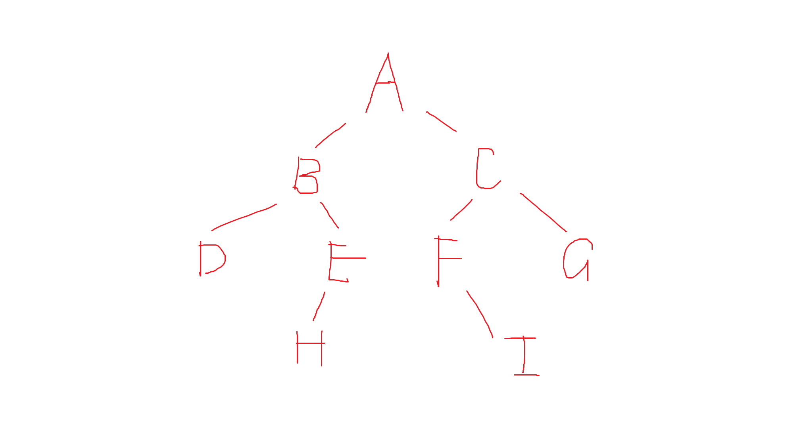
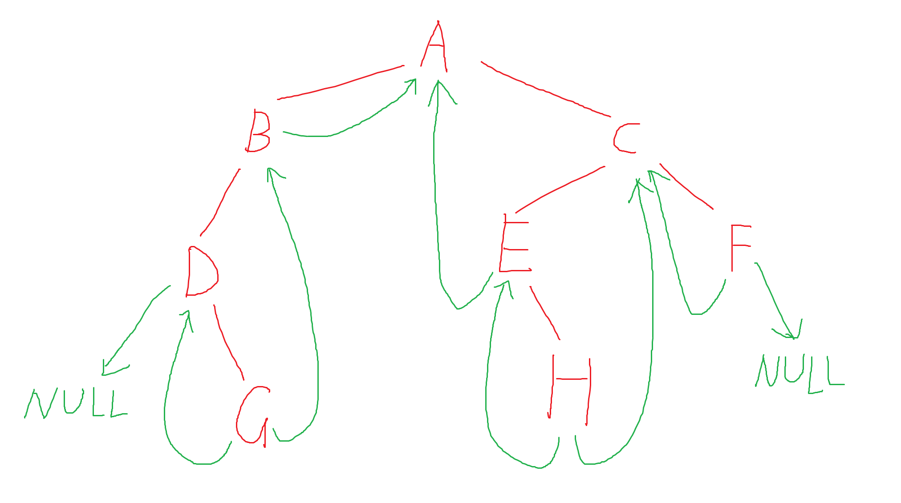

# 二叉树
## 顺序表表示二叉树
```c
#include <stdio.h>
#include <stdlib.h>
#define N 2000

// 树的存储结构：数组
typedef struct
{
    int elem[N];
} tree;

// 初始化：所有值修改为-1
void initTree(tree *t)
{
    for(int i = 0; i < N; i++)
    {
        t->elem[i] = -1;
    }
}

// 返回结点的双亲节点
int parent(tree *t, int x)
{
    if(x == 1 || t->elem[x] == -1)return -1;
    return x/2;
}

// 返回结点的左孩子结点
int lChild(tree *t, int x)
{
    if(t->elem[x] == -1 || t->elem[2*x] == -1)return -1;
    return 2*x;
}

// 返回结点的右孩子结点
int rChild(tree *t, int x)
{
    if(t->elem[x] == -1 || t->elem[2*x+1] == -1)return -1;
    return 2*x+1;
}

// 输入
void input(tree *t)
{
    int n; 
    scanf("%d", &n);
    for(int i = 1; i < n+1; i++)
    {
        scanf("%d", &(t->elem[i]));
    }
}

// 先序遍历
void traverse(tree *t, int cnt)
{
    if(t->elem[cnt] == -1)return;
    printf("%d ", t->elem[cnt]);
    traverse(t, 2*cnt);
    traverse(t, 2*cnt+1);
}

int main()
{
    tree *t = (tree*)malloc(sizeof(tree));
    initTree(t);
    input(t);
    traverse(t, 1);
    return 0;
}
/*
input:
7
1 2 3 4 5 6 7

output:
1 2 4 5 3 6 7
*/
```

树的结构：


## 二叉链表
按先序输入二叉树各结点，其中#表示取消建立子树结点。  
二叉树建立完成后，对其进行先序、中序、后序遍历，并输出叶子节点个数和树的深度。

例如，要建立上图所示二叉树，需要输入：
```
ABD..EH...CF.I..G..
```

实现代码：
```c
#include <stdio.h>
#include <stdlib.h>
#include <string.h>
#define N 2000

int cnt = 0;

// 二叉链表结点
typedef struct node
{
    char data;
    struct node *lChild;
    struct node *rChild;
} node;

// 创建二叉链表
void init(node** n, char *str)
{
    char tmp = str[cnt];
    cnt++;
    if(tmp == '.')
    {
        *n = NULL;
        return;
    }
    *n = (node*)malloc(sizeof(node));
    (*n)->data = tmp;
    init(&((*n)->lChild), str);
    init(&((*n)->rChild), str);
}

// 访问结点
void visit(node* n)
{
    printf("%c ", n->data);
}

// 先序遍历
void preOrder(node* n)
{
    if(n != NULL)
    {
        visit(n);
        preOrder(n->lChild);
        preOrder(n->rChild);
    }
}

// 中序遍历
void inOrder(node* n)
{
    if(n != NULL)
    {
        inOrder(n->lChild);
        visit(n);
        inOrder(n->rChild);
    }
}

// 后序遍历
void postOrder(node* n)
{
    if(n != NULL)
    {
        postOrder(n->lChild);
        postOrder(n->rChild);
        visit(n);
    }
}

// 返回结点表示树的叶子节点个数
int leaf(node* n)
{
    if(n == NULL)return 0;
    else if(n->lChild == NULL && n->rChild == NULL) return 1;
    else return leaf(n->lChild)+leaf(n->rChild);
}

// 返回树的深度
int depth(node* n)
{
    if(n == NULL)return 0;
    else if(n->lChild == NULL && n->rChild == NULL)return 1;
    else return (depth(n->lChild)>depth(n->rChild) ? depth(n->lChild) : depth(n->rChild))+1;
    // the max depth of two children + 1;
}

int main()
{
    node* tree;
    char str[N] = {0};
    scanf("%s", str);
    init(&tree, str);

    preOrder(tree);
    printf("\n");
    inOrder(tree);
    printf("\n");
    postOrder(tree);
    printf("\n");

    printf("The leaf(ves) in the tree: %d\n", leaf(tree));
    printf("The depth of the tree: %d\n", depth(tree));
    return 0;
}
/*
input:
ABD..EH...CF.I..G..

output:
preOrder: A B D E H C F I G
inOrder: D B H E A F I C G
postOrder: D H E B I F G C A
The leaf(ves) in the tree: 4
The depth of the tree: 4
*/
```

## 线索二叉树
二叉链表中，若一个结点没有左右孩子，可将其左右孩子节点设置为中序遍历时的前驱和后继节点以充分利用空间（没有时为`NULL`）。

如下图:


可以通过线索更快捷找到后继节点。

```c
// in-order thread
#include <stdio.h>
#include <stdlib.h>
#include <string.h>
#define N 2000

int cnt = 0;

typedef struct node
{
    char data;
    int Ltag, Rtag;
    struct node *lChild;
    struct node *rChild;
} node;

void init(node** n, char *str)
{
    char tmp = str[cnt];
    cnt++;
    if(tmp == '.')
    {
        *n = NULL;
        return;
    }
    *n = (node*)malloc(sizeof(node));
    (*n)->data = tmp;
    init(&((*n)->lChild), str);
    init(&((*n)->rChild), str);
}

node* pre = NULL;

void tag(node* n)
{
    if(n->lChild == NULL)
    {
        n->Ltag = 1;
        n->lChild = pre;
    }
    else
    {
        n->Ltag = 0;
    }

    if(pre != NULL && pre->rChild == NULL)
    {
        pre->Rtag = 1;
        pre->rChild = n;
    }
    else if(pre != NULL)
    {
        pre->Rtag = 0;
    }

    pre = n;
}

void thread(node *n)
{
    if(n != NULL)
    {
        thread(n->lChild);
        tag(n);
        thread(n->rChild);
    }
}

node* first(node* tree)
{
    node* p = tree;
    if(p == NULL)return NULL;

    while(p->Ltag == 0) p = p->lChild;
    return p;
}

void visit(node* n)
{
    printf("%c ", n->data);
}

node* next(node *n)
{
    if(n->Rtag == 1)return n->rChild;
    if(n->rChild == NULL)return NULL;
    
    node *p = NULL;
    for(node *q = n->rChild;; q = q->lChild)
    {
        p = q;
        if(q->Ltag == 1)break;
    }
    return p;
}

void traverse(node* tree)
{
    node* p = first(tree);
    while(p != NULL)
    {
        visit(p);
        p = next(p);
    }
}

int main()
{
    node* tree;
    char str[N] = {0};
    scanf("%s", str);
    init(&tree, str);
    thread(tree);
    traverse(tree);
    return 0;
}
/*
input:
ABD.G...CE.H..F..

output:
D G B A E H C F
*/
```

## 哈夫曼树
### 输入
输入表示字符集大小为 n（n<=100）的正整数，以及 n 个字符和 n 个权值（正整数，值越大表示该字符出现的概率越大）；输入串长小于或等于 100 的目标报文。
### 输出
经过编码后的二进制码，占一行；  
以及对应解码后的报文，占一行；  

```c
// the type of huffman: static tree
//
// The small weight will be put in the left child while the big one in the right.
// When encoding, the left is 0 and the right is 1.
#include <stdio.h>
#include <stdlib.h>
#include <string.h>
#define N 2000

char str[N] = {0};
char code[N] = {0};
char restr[N] = {0};

typedef struct 
{
    char data;
    int weight;
    int parent, lChild, rChild;
} node;

void input(char *a, int *w, int n)
{
    int cnt = 0;
    for(int i = 0; i < n; i++)
    {
        scanf(" %c", &a[i]);
    }
    for(int i = 0; i < n; i++)
    {
        scanf("%d", &w[i]);
    }
    scanf("%s", str);
}

void init(node* tree, int n, char *a, int *w)
{
    for(int i = 0; i < 2*n-1; i++)
    {
        tree[i].data = 0;
        tree[i].lChild = -1;
        tree[i].rChild = -1;
        tree[i].parent = -1;
        tree[i].weight = 0;
    }

    for(int i = 0; i < n; i++)
    {
        tree[i].data = a[i];
        tree[i].weight = w[i];
    }

    for(int i = 0; i < n-1; i++)
    {
        int l = N+1, r = N+1, pl = -1, pr = -1;
        for(int j = 0; j < n+i; j++)
        {   
            int tmp = tree[j].weight;
            if(tmp < l && tree[j].parent == -1)
            {
                r = l; pr = pl;
                l = tmp; pl = j;
            }
            else if(tmp < r && tree[j].parent == -1)
            {
                r = tmp; pr = j;
            }
        }

        tree[n+i].weight = tree[pl].weight + tree[pr].weight;
        tree[n+i].lChild = pl; tree[n+i].rChild = pr;
        tree[pl].parent = n+i; tree[pr].parent = n+i;
    }
}

void encode(node* tree, int n)
{     
    int slen = strlen(str);
    int clen = 0;
    for(int i = 0; i < slen; i++)
    {
        char tmp = str[i];
        int p=0, q=0;
        char part[N] = {0};
        int cnt = 0;
        for(int j = 0; j < n; j++)
        {
            if(tree[j].data == tmp)
            { 
                p = j; break;
            }
        }

        while(q != 2*n-2)
        {
            q = tree[p].parent;
            if(tree[q].lChild == p)
            {
                part[cnt] = '0';
            }
            else if(tree[q].rChild == p)
            {
                part[cnt] = '1';
            }
            cnt++;
            p = q;
        }

        for(int j = cnt-1; j >= 0; j--)
        {
            code[clen] = part[j];
            clen++;
        }
    }
    // printf("%s\n", code);

    // printf("%s\n", str);
}

void decode(node* tree, int n)
{
    int clen = 0;
    int slen = 0;
    while(clen < strlen(code))
    {
        int p = 2*n-2; 
        while(p >= n)
        {
            char tmp = code[clen];
            if(tmp == '0')
            {
                p = tree[p].lChild;
            }
            else if(tmp == '1')
            {
                p = tree[p].rChild;
            }
            clen++;
        }
        restr[slen] = tree[p].data;
        slen++;
    }
    // printf("%s", restr);
}

void output()
{
    printf("%s\n%s", code, restr);

}

int main()
{
    node *tree = NULL;
    char a[N] = {0};
    int w[N] = {0};
    char c[N][N] = {0};
    int n;

    scanf("%d", &n);
    tree = (node*)malloc(sizeof(node) * (2*n-1));
    input(a, w, n);
    init(tree, n, a, w);
    encode(tree, n);
    decode(tree, n);
    output();
    return 0;
}
/*
input: 
5 a b c d e 12 40 15 8 25
bbbaddeccbbb

output:
00011111110111010110110000
bbbaddeccbbb
*/
```