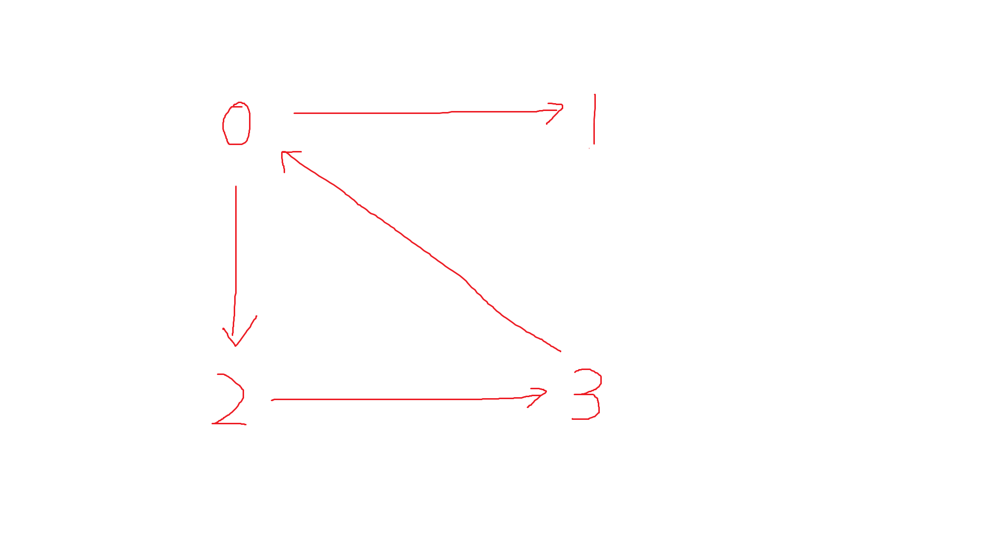
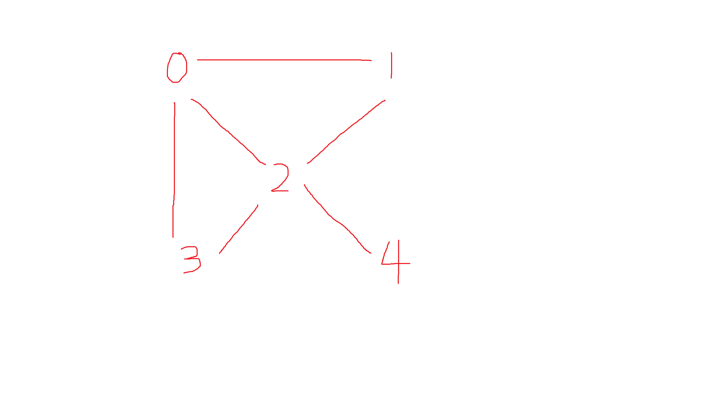
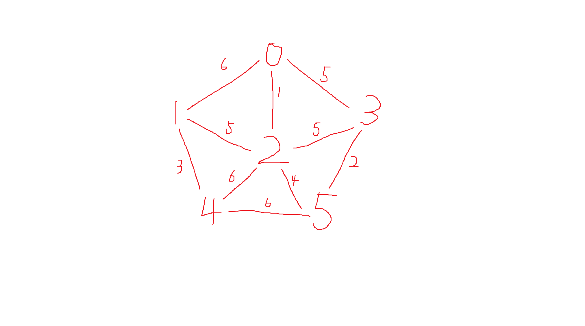
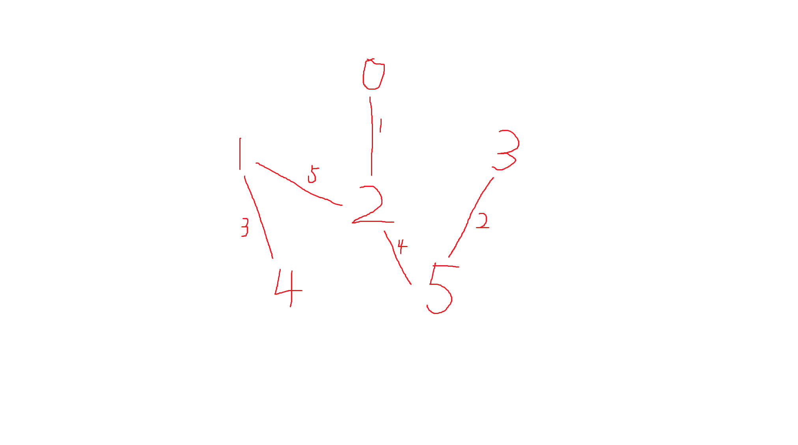
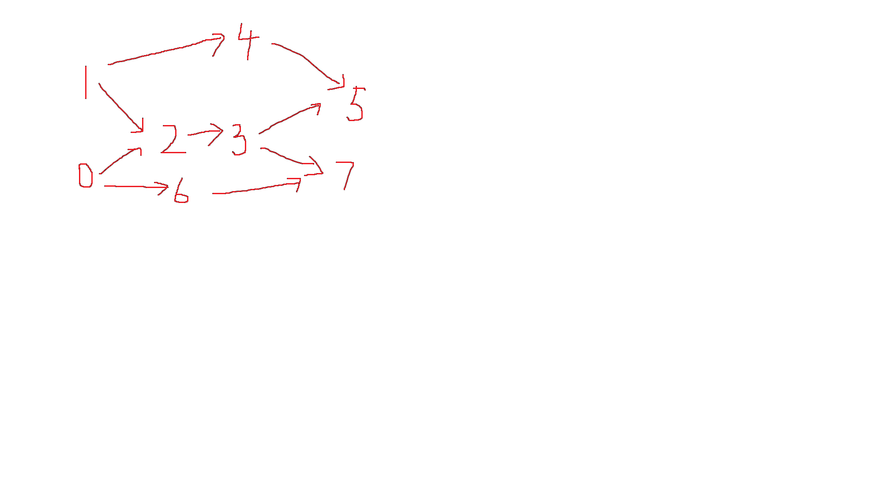

# 图
## 邻接矩阵的遍历
包含深度优先和广度优先。

图的结构：



### 输入
先输入一个数m，表示G1的结点个数。  
接下来m行，每行输入2个数，代表G1的一条边（有向图）。  
再输入一个数n，表示G2的结点个数。    
接下来n行，每行输入2个数，代表G2的一条边（无向图）。

```c
#include <stdio.h>
#include <stdlib.h>
#define N 200

int g1[N][N] = {0}; // directed graph
int g2[N][N] = {0}; // undirected graph

int s[N] = {0};

typedef struct 
{
    int elem[N];
    int front; 
    int rear;
} queue;

void initQueue(queue* q)
{
    q->front = q->rear = 0;
}

int isEmpty(queue *q)
{
    return q->front == q->rear;
}

int isFull(queue *q)
{
    return (q->rear+1) % N == q->front;
}

int push(queue *q, int x)
{
    if(isFull(q))return -1;
    
    q->elem[q->rear] = x;
    q->rear = (q->rear+1) % N;
    return 1;
}

int pop(queue *q, int *x)
{
    if(isEmpty(q))return -1;
    *x = q->elem[q->front];
    q->front = (q->front+1) % N;
    return 1;
}

void init1(int g[N][N])
{
    int n; 
    scanf("%d", &n);

    for(int i = 0; i < n; i++)
    {
        int p, q;
        scanf("%d%d", &p, &q);
        g[p][q] = 1;
    }
}

void init2(int g[N][N])
{
    int n; 
    scanf("%d", &n);

    for(int i = 0; i < n; i++)
    {
        int p, q;
        scanf("%d%d", &p, &q);
        g[p][q] = g[q][p] = 1;
    }
}

void reset()
{
    for(int i = 0; i < N; i++)
    {
        s[i] = 0;
    }
}

void visit(int p)
{
    if(s[p] == 0)
    {
        printf("%d ", p);
        s[p] = 1;
    }
}

void dfs(int g[N][N], int p)
{
    visit(p);
    for(int i = 0; i < N; i++)
    {
        if(g[p][i] == 1 && s[i] == 0) 
        {
            dfs(g, i);
        }
    }
}

void bfs(int g[N][N], int p)
{
    queue *q = (queue*)malloc(sizeof(queue));
    initQueue(q);
    push(q, p);

    while(!isEmpty(q))
    {
        int *x = (int*)malloc(sizeof(int));
        pop(q, x);
        visit(*x);

        for(int i = 0; i < N; i++)
        {
            if(g[*x][i] == 1 && s[i] == 0)
            {
                push(q, i);
            }
        }
    }
}

int main()
{
    init1(g1);
    init2(g2);

    reset();
    printf("dfs for g1: ");
    dfs(g1, 0);
    printf("\n");

    reset();
    printf("dfs for g2: ");
    dfs(g2, 0);
    printf("\n");

    reset();
    printf("bfs for g1: ");
    bfs(g1, 0);
    printf("\n");

    reset();
    printf("bfs for g2: ");
    bfs(g2, 0);
    printf("\n");
    return 0;
}
/*
input:
4
0 1
0 2
2 3
3 1
6
0 1
0 2
0 3
1 2
2 3
2 4

output:
dfs for g1: 0 1 2 3
dfs for g2: 0 1 2 3 4
bfs for g1: 0 1 2 3
bfs for g2: 0 1 2 3 4

*/
```

## 邻接表的遍历
```c
#include <stdio.h>
#include <stdlib.h>
#define N 200

int s[N] = {0};

typedef struct node
{
    int data;
    struct node *next;
} node;

typedef struct 
{
    int elem[N];
    int front; 
    int rear;
} queue;

void initQueue(queue* q)
{
    q->front = q->rear = 0;
}

int isEmpty(queue *q)
{
    return q->front == q->rear;
}

int isFull(queue *q)
{
    return (q->rear+1) % N == q->front;
}

int push(queue *q, int x)
{
    if(isFull(q))return -1;
    
    q->elem[q->rear] = x;
    q->rear = (q->rear+1) % N;
    return 1;
}

int pop(queue *q, int *x)
{
    if(isEmpty(q))return -1;
    *x = q->elem[q->front];
    q->front = (q->front+1) % N;
    return 1;
}

void init1(node *g[N])
{
    int n;
    scanf("%d", &n);

    for(int i = 0; i < N; i++)
    {
        g[i] = (node*)malloc(sizeof(node));
        g[i]->next = NULL;
    }

    for(int i = 0; i < n; i++)
    {
        int m, n;
        scanf("%d%d", &m, &n);

        node *p = g[m];
        while(p->next != NULL)
        {
            p = p->next;
        }

        p->next = (node*)malloc(sizeof(node));
        p = p->next;
        p->data = n;
        p->next = NULL;
    }
}

void init2(node *g[N])
{
    int n;
    scanf("%d", &n);

    for(int i = 0; i < N; i++)
    {
        g[i] = (node*)malloc(sizeof(node));
        g[i]->next = NULL;
    }

    for(int i = 0; i < n; i++)
    {
        int m, n;
        scanf("%d%d", &m, &n);

        node *p  = NULL;
        p = g[m];
        while(p->next != NULL)
        {
            p = p->next;
        }

        p->next = (node*)malloc(sizeof(node));
        p = p->next;
        p->data = n;
        p->next = NULL;

        p = g[n];
        while(p->next != NULL)
        {
            p = p->next;
        }

        p->next = (node*)malloc(sizeof(node));
        p = p->next;
        p->data = m;
        p->next = NULL;
    }
}

void reset()
{
    for(int i = 0; i < N; i++)
    {
        s[i] = 0;
    }
}

void visit(int p)
{
    if(s[p] == 0)
    {
        printf("%d ", p);
        s[p] = 1;
    }
}

void dfs(node *g[N], int x)
{
    visit(x);
    
    node *p = g[x]->next;
    while(p != NULL)
    {
        if(!s[p->data]) dfs(g, p->data);
        p = p->next;
    }
}

void bfs(node *g[N], int x)
{
    queue *q = (queue*)malloc(sizeof(queue));
    initQueue(q);
    push(q, x);
    
    while(!isEmpty(q))
    {
        int *t = (int*)malloc(sizeof(int));
        pop(q, t);
        visit(*t);

        node *p = g[*t]->next;
        while(p != NULL)
        {
            if(!s[p->data]) push(q, p->data);;
            p = p->next;
        }
    }
}

int main()
{
    node *g1[N];
    node *g2[N];
    init1(g1);
    init2(g2);

    reset();
    printf("dfs for g1: ");
    dfs(g1, 0);
    printf("\n");

    reset();
    printf("dfs for g2: ");
    dfs(g2, 0);
    printf("\n");

    reset();
    printf("bfs for g1: ");
    bfs(g1, 0);
    printf("\n");

    reset();
    printf("bfs for g2: ");
    bfs(g2, 0);
    printf("\n");
    return 0;
}
/*
input:
4
0 1
0 2
2 3
3 1
6
0 1
0 2
0 3
1 2
2 3
2 4

output:
dfs for g1: 0 1 2 3
dfs for g2: 0 1 2 3 4
bfs for g1: 0 1 2 3
bfs for g2: 0 1 2 3 4

*/
```

## 最小生成树
### 输入
一个无向图，规则与之前一样。
### 输出
一个最小生成树的所有边和路径之和。

### 无向图和最小生成树



### prim
```c
#include <stdio.h>
#define N 200
#define INF 10000

int arcs[N][N] = {0};   // 邻接矩阵
int s[N] = {0};         // 结点是否加入
int p[N] = {0};
int min[N] = {0};
int road = 0;

void init(int g[N][N], int n, int cnt)
{
    for(int i = 0; i < cnt; i++)
    {
        int p, q, v;
        scanf("%d%d%d", &p, &q, &v);
        g[p][q] = g[q][p] = v;
    }

    for(int i = 0; i < n; i++)
    {
        for(int j = 0; j < n; j++)
        {
            if(g[i][j] == 0) g[i][j] = INF;
        }
    }
}

void reset()
{
    for(int i = 0; i < N; i++)
    {
        s[i] = 0;
        p[i] = 0;
        min[i] = INF;
        road = 0;
    }
}

void prim(int x, int n)
{
    for(int i = 0; i < n; i++)
    {
        min[i] = arcs[x][i];
    }

    s[x] = 1;
    for(int i = 0; i < n-1; i++)
    {
        int m = INF, t = -1;
        for(int j = 0; j < n; j++)
        {
            if(s[j])continue;
            if(min[j] < m) 
            {
                m = min[j];
                t = j;
            }
        }
        s[t] = 1;
        road += m;
        printf("%d %d\n", p[t], t);
        
        for(int j = 0; j < n; j++)
        {
            if(arcs[t][j] < min[j] && s[j] == 0)
            {
                min[j] = arcs[t][j];
                p[j] = t;
            }
        }  
    }
    printf("%d\n", road);
}

int main()
{
    int n, cnt;
    scanf("%d%d", &n, &cnt);
    init(arcs, n, cnt);

    reset();
    prim(0, n);

    return 0;
}
/*

input: 
6 10
0 1 6
0 2 1
0 3 5
1 2 5
1 4 3
2 3 5
2 4 6
2 5 4
3 5 2
4 5 6

output:
0 2
2 5
5 3
2 1
1 4
15

*/
```

### kruscal
```c
#include <stdio.h>
#define N 200
#define INF 10000

int arcs[N][N] = {0};   // 邻接矩阵
int s[N] = {0};         // 结点集合
int n = 0;              // 结点个数
int road = 0;           // 最短路径长度

void init(int g[N][N], int cnt)
{
    for(int i = 0; i < cnt; i++)
    {
        int p, q, v;
        scanf("%d%d%d", &p, &q, &v);
        g[p][q] = g[q][p] = v;
    }

    for(int i = 0; i < n; i++)
    {
        for(int j = 0; j < n; j++)
        {
            if(g[i][j] == 0) g[i][j] = INF;
        }
    }
}

void reset()
{
    for(int i = 0; i < n; i++)
    {
        s[i] = i;
    }
    road = 0;
}

int find(int x)
{
    if(s[x] == x) return x;
    else return find(s[x]);
}

int isRing(int p, int q)
{
    return find(p) == find(q);
}

void kruscal()
{
    for(int _ = 0; _ < n-1; _++)
    {
        int min = INF, p = -1, q = -1;

        for(int i = 0; i < n; i++)
        {
            for(int j = i+1; j < n; j++)
            {
                if(arcs[i][j] < min)
                {
                    if(!isRing(i, j))
                    {
                        min = arcs[i][j]; p = i; q = j;
                    }
                } 
            }
        }

        s[find(q)] = p;

        road += min;
        printf("%d %d\n", p, q);
    }
    printf("%d\n", road);
}

int main()
{
    int cnt;
    scanf("%d%d", &n, &cnt);
    init(arcs, cnt);

    reset();
    kruscal();

    return 0;
}

/*

input: 
6 10
0 1 6
0 2 1
0 3 5
1 2 5
1 4 3
2 3 5
2 4 6
2 5 4
3 5 2
4 5 6

output:
0 2
3 5
1 4
2 5
1 2
15

*/
```

## 拓扑序列
给定有向图，生成其中一个拓扑序列。


```c
#include <stdio.h>
#include <stdlib.h>
#define N 200

typedef struct 
{
    int elem[N];
    int front; 
    int rear;
} queue;

void initQueue(queue* q)
{
    q->front = q->rear = 0;
}

int isFull(queue *q)
{
    return (q->rear+1) % N == q->front;
}

int isEmpty(queue *q)
{
    return q->front == q->rear;
}

int push(queue *q, int x)
{
    if(isFull(q))return -1;
    
    q->elem[q->rear] = x;
    q->rear = (q->rear+1) % N;
    return 1;
}

int pop(queue *q, int *x)
{
    if(isEmpty(q))return -1;
    *x = q->elem[q->front];
    q->front = (q->front+1) % N;
    return 1;
}

int arcs[N][N] = {0};
int in[N] = {0};        // 结点的入度
int s[N] = {0};

int n = 0;

void init()
{
    int cnt = 0;
    scanf("%d%d", &n, &cnt);
    for(int i = 0; i < cnt; i++)
    {
        int p, q;
        scanf("%d%d", &p, &q);
        arcs[p][q] = 1;
    } 
    
    for(int i = 0; i < n; i++)
    {
        for(int j = 0; j < n; j++)
        {
            in[i] += arcs[j][i];
        }
    }
}

void top()
{
    queue *q = (queue*)malloc(sizeof(queue));
    initQueue(q);
    while(1)
    {
        for(int i = 0; i < n; i++)
        {
            if(in[i] == 0 && s[i] == 0)
            {
                s[i] = 1;
                push(q, i);
            }
        }

        if(isEmpty(q)) break;

        int *x = (int*)malloc(sizeof(int));
        pop(q, x);
        printf("%d ", *x);
        for(int i = 0; i < n; i++)
        {
            in[i] -= arcs[*x][i];
        }
    }
    printf("\n");
}

int main()
{
    init();
    top();
    return 0;
}

/*

input:
8 9
0 2
0 6
1 2
1 4
2 3
3 5
3 7
4 5
6 7

output:
0 1 6 2 4 3 5 7

*/
```

## 结点之间的最短路径
输入图的邻接矩阵（若两节点没有相连，则距离为无穷大，此处默认为10000）

对于给定的两个结点，要按顺序输出最短路径所包含的结点，同时还要输出路径长度。

### dijkstra
```c
#include <stdio.h>
#define N 100               // 最大顶点数
#define INF 10000           // 无穷

int arcs[N][N] = {0};       // 邻接矩阵
int path[N][N][N] = {0};    // 最短路径所含顶点
int n = 0;

// 输入n和邻接矩阵
void init()
{
    scanf("%d", &n);
    for(int i = 0; i < n; i++)
    {
        for(int j = 0; j < n; j++)
        {
            scanf("%d", &arcs[i][j]);
        }
    }

    for(int i = 0; i < n; i++)
    {
        for(int j = 0; j < n; j++)
        {
            for(int k = 0; k < n; k++)
            {
                path[i][j][k] = -1;
            }
        }
    }          
}

// 使用dijkstra算法计算start到其它顶点的最短路径
void dijkstra(int start)
{
    int dist[N] = {0};  // 最短路径长度
    int s[N] = {0};     // 顶点是否找到最短路径，是1否0
    s[start] = 1;       // 初始只有顶点start有最短路径

    // 通过n次循环设置arcs和path的初始值
    for(int i = 0; i < n; i++)
    {
        dist[i] = arcs[start][i];   // 将最短长度初始值设置成两顶点之间的弧长

        // 如果不是INF的话，就可以设置path的值
        if(dist[i] != INF)
        {
            // 起始点是它自己
            path[start][i][0] = start;

            // 如果最短路径不是自己和自己连的话，那么第二个点就是终结点了。
            if(i != start)
            {
                path[start][i][1] = i;
                path[start][i][2] = -1;
            }
            else
            {
                path[start][i][1] = -1;
            }
        }
    }

    // 进行n-1次循环，每次检索一个最短路径
    for(int i = 0; i < n-1; i++)
    {
        // k为可能要加入s的顶点下标，min为它的目前最短值
        int k = -1, min = INF;

        // 进行n次循环，找到k和min，然后加入s
        for(int j = 0; j < n; j++)
        {
            if(s[j] == 1)continue;    // 如果已经在s里面了就跳过
            if(dist[j] < min)
            {
                min = dist[j];
                k = j;
            }
        }
        if(min < INF)s[k] = 1;  // 把INF放进去就说不过去了，那不等于没找吗！

        // 进行n次循环，利用顶点k更新当前最短路径
        for(int j = 0; j < n; j++)
        {
            if(s[j] == 1)continue;    // 如果已经在s里面了就跳过

            int tmp = dist[k] + arcs[k][j]; // 可能的新长度：k的最短路径 + k到j的弧

            // 如果比现在的短，就更新dist和path
            if(tmp < dist[j])
            {
                dist[j] = tmp;
                int l;
                for(l = 0; path[start][k][l] != -1; l++)
                {
                    path[start][j][l] = path[start][k][l];
                }
                path[start][j][l] = j;  
                path[start][j][l+1] = -1;  
            }
        }
    }

    // 将找不到最短路径的顶点path设置为只有它自己
    for(int i = 0; i < n; i++)
    {
        if(s[i] == 0)
        {
            path[start][i][0] = i;
            path[start][i][1] = -1;
        }
    }
}

// 输出p到q的最短路径长度和所含顶点（p和q在里面输入）
void output()
{
    int t = 0;
    scanf("%d", &t);

    for(int _ = 0; _ < t; _++)
    {
        int p = -1, q = -1, dist = 0;
        scanf("%d%d", &p, &q);

        // 逐个输出path里面的顶点，输出到它自己时停止
        for(int i = 0;; i++)
        {
            printf("%d ", path[p][q][i]);
            if(path[p][q][i] == q)break;
            dist += arcs[ path[p][q][i] ] [ path[p][q][i+1] ];
        }
        printf("\n");
        printf("%d\n", dist);
    }
}

int main()
{  
    init();    

    // 对每个顶点执行一次dijkstra算法
    for(int i = 0; i < n; i++)
    {
        dijkstra(i);
    }
    
    output();
    return 0;
}
/*
input:
4
0 2 10 10000
2 0 7 3
10 7 0 6
10000 3 6 0
2
0 2
0 3

output:
0 1 2
9
0 1 3
5

*/
```
### floyd
```c
#include <stdio.h>
#define N 100           // 最大顶点数
#define INF 10000       // 无穷

int arcs[N][N] = {0};       // 邻接矩阵
int dist[N][N] = {0};       // 最短路径长度
int path[N][N][N] = {0};    // 最短路径所含顶点
int n = 0;                  // 图的顶点数

// 输入n和邻接矩阵
void init()
{
    scanf("%d", &n);
    for(int i = 0; i < n; i++)
    {
        for(int j = 0; j < n; j++)
        {
            scanf("%d", &arcs[i][j]);
        }
    }

    // 把path的值设置成-1（空）
    for(int i = 0; i < n; i++)
        for(int j = 0; j < n; j++)
            for(int k = 0; k < n; k++)
                path[i][j][k] = -1;
}

void floyd()
{
    // 通过n次循环设置arcs和path的初始值
    for(int i = 0; i < n; i++)
    {
        for(int j = 0; j < n; j++)
        {
            dist[i][j] = arcs[i][j];    // 将最短长度初始值设置成两顶点之间的弧长

            // 如果不是INF的话，就可以设置path的值
            if(dist[i][j] != INF)
            {
                path[i][j][0] = i;      // 起始点是它自己

                // 如果最短路径不是自己和自己连的话，那么第二个点就是终结点了。
                if(i != j) path[i][j][1] = j;   
            }
        }
    }

    // 进行k*i*j次循环，更新dist和path
    for(int k = 0; k < n; k++)
    {
        for(int i = 0; i < n; i++)
        {
            for(int j = 0; j < n; j++)
            {
                int tmp = dist[i][k] + dist[k][j];  // 可能的更短路径长度

                // 如果更短，就更新dist和path
                if(tmp < dist[i][j]) 
                {
                    dist[i][j] = tmp;

                    int cnt = 0;
                    for(int l = 0; path[i][k][l] != -1; l++)
                    {
                        path[i][j][cnt] = path[i][k][l];
                        cnt++;
                    }
                    for(int l = 1; path[k][j][l] != -1; l++)
                    {
                        path[i][j][cnt] = path[k][j][l];
                        cnt++;
                    }
                }
            }
        }
    }

    // 将找不到最短路径的顶点path设置为只有它自己
    for(int i = 0; i < n; i++)
    {
        for(int j = 0; j < n; j++)
        {
            if(dist[i][j] == INF)
            {
                path[i][j][0] = i;
            }
        }
    }
}

void output()
{
    int t = 0;
    scanf("%d", &t);

    for(int _ = 0; _ < t; _++)
    {
        int p = -1, q = -1, dist = 0;
        scanf("%d%d", &p, &q);

        // 逐个输出path里面的顶点，输出到它自己时停止
        for(int i = 0;; i++)
        {
            printf("%d ", path[p][q][i]);
            if(path[p][q][i] == q)break;
            dist += arcs[ path[p][q][i] ] [ path[p][q][i+1] ];
        }
        printf("\n");
        printf("%d\n", dist);
    }
}

int main()
{
    init();
    floyd();
    output();
    return 0;
}
/*
input:
4
0 2 10 10000
2 0 7 3
10 7 0 6
10000 3 6 0
2
0 2
3 0

output:
0 1 2
9
3 1 0
5

*/
```